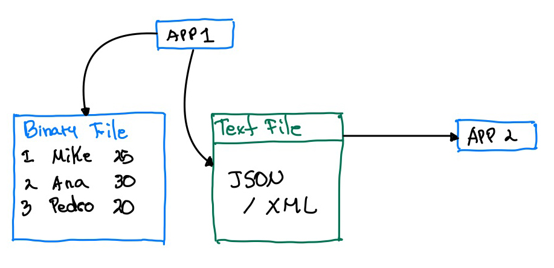

# Lab 07 Files, and serialization 

The idea of this laboratory is create two small apps:

## App 1

- We have a *Person* entity with the following properties:
  - Id
  - Age
  - Name
- Create a list of *Person*
- Save that information in a Binary File
- Save and serialize that information with (XML or JSON)
- Need to use SOLID DIP in the design

## App 2

- Deserialize the information from App 1
- Show in the screen the information of App 1